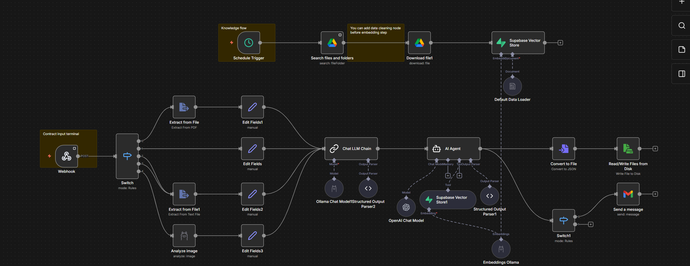

# smart_contact_sys ✅

**A simple, lightweight file upload demo (Next.js + App Router)**

This is a small example app built with Next.js (App Router) and React that demonstrates file uploads and optionally forwards uploaded files to a configured webhook.

---

## Key Features 🔧

- Frontend file upload component (using `react-dropzone`)
- Server-side upload handling: `POST /api/upload` accepts a `file` field and can forward it to `WEBHOOK_URL`
- TypeScript + ESLint setup

---

## Quick Start 🚀

### Requirements

- Node.js 18+ (LTS recommended)
- npm / pnpm / yarn

### Install & Run (development)

From the project root, change into the `app` folder and install dependencies:

```powershell
cd app
npm install
npm run dev
```

Dev server: http://localhost:3000

### Build & Run (production)

```powershell
# Build
npm run build
# Start production server
npm run start
```

### Linting

```powershell
npm run lint
```

---

## API: Upload Endpoint 📡

- Route: `POST /api/upload`
- Payload: multipart/form-data with a `file` field
- Behavior:
  - Returns 400 if no `file` is provided
  - If `WEBHOOK_URL` environment variable is set, the server forwards the received file (as `file`) to that URL and surfaces the webhook response status
  - If `WEBHOOK_URL` is not set, the server returns success but logs a warning

Implementation: `src/app/api/upload/route.ts`

---

## Project Structure Overview 🗂️

- `app/` - Next.js application (entry)
  - `src/app/` - app source (pages, components, API routes)
  - `src/app/api/upload/route.ts` - upload handling logic
  - `components/` - frontend components (including file upload)
- `LICENSE` - license file

---

## Debugging & Logs ⚠️

- The server prints basic trace logs to the console (uploaded filename, size, webhook call status, etc.), which can be helpful during development.

---

## Contributing & Issues 🤝

Contributions are welcome—please open an issue or a pull request and follow the project's coding style. Include a short description of the change.

---

## n8n Integration 🔗

This repository includes an n8n workflow that can receive uploaded files via a webhook. The workflow is provided as `Contract.json` at the repository root.

### Import the workflow

1. Open your n8n editor (e.g., http://localhost:5678).
2. Go to **Workflows → Import** and choose **Import from file**.
3. Upload `Contract.json` from this repository and open the imported workflow.
4. Locate the **Webhook** node and verify:
   - Method: **POST**
   - Path: **`ac736975-2dff-4649-a2bb-a09ca7f71c61`**
   - Binary property name: **`data`** (uploaded file will appear at `$binary.data`)
5. Activate the workflow so the webhook is reachable.

### Configure your app to forward uploads

Set the `WEBHOOK_URL` environment variable in your app to point to the imported webhook. Example:

```env
WEBHOOK_URL= your n8n webhook url
update it in app/.env.local
```


```bash
# Start ngrok to expose port 5678 (n8n default)
ngrok http 5678
# Then set WEBHOOK_URL to the generated https URL, e.g.:
# WEBHOOK_URL=https://abcd1234.ngrok.io/webhook/ac736975-2dff-4649-a2bb-a09ca7f71c61
```

### Quick test

Upload a test file to your app's upload endpoint (example using curl):

```bash
curl -F "file=@./app/test.txt" https://<your-app-host>/api/upload
```

The file should be forwarded to n8n and visible in the Webhook node execution (check `$json.headers` and `$binary.data`).

### Troubleshooting 🔧

- Ensure the workflow is **activated** in n8n.
- Make sure `WEBHOOK_URL` path matches the webhook path shown in the Webhook node.
- If using ngrok, use the **https** forwarding URL.
- Use n8n's Execution pane to inspect incoming requests and binary data.

---

## License 🧾

This project is licensed as specified in the `LICENSE` file at the repository root. Please refer to that file for details.

**Thanks for using the project!**